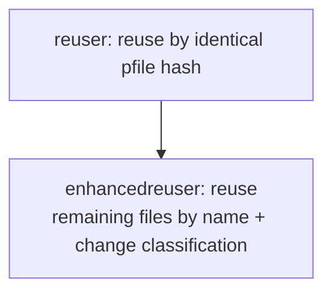
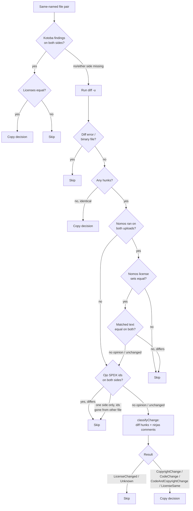

<!--
SPDX-FileCopyrightText: © 2026 Saksham Mishra
SPDX-License-Identifier: GPL-2.0-only
-->

# enhancedreuser agent

`enhancedreuser` extends FOSSology's standard "reuse" feature. The stock
`reuser` agent only copies a clearing decision from a previously cleared
upload to a new upload when the reused file's content is **byte-identical**
(same pfile hash). `enhancedreuser` additionally copies decisions for files
that are *similar but not identical* — e.g. a copyright year bump, a
reformatted comment, or an unrelated code change elsewhere in the file — by
matching files by name and classifying what actually changed between the two
versions.

It runs as a dependency of `reuser` and is scheduled automatically when a
user selects "Enhanced Reuse" in the reuser configuration; it has no
standalone UI.

## Where it fits



`enhancedreuser` only looks at pfiles that:
1. have a clearing decision in the **reused** upload, and
2. do **not already** have a clearing decision at a matching file path/name
   in the **target** upload (i.e. whatever the standard hash-based reuser
   already handled is skipped).

## Decision pipeline

For each candidate pfile pair (reused file ↔ same-named target file),
`enhancedreuser` runs a sequence of gates, in order, and stops at the first
one that reaches a verdict. Later gates only run if earlier ones have no
opinion (missing/insufficient scanner data on one or both sides).



### 1. Kotoba license oracle ([KotobaChecker.cc](agent/KotobaChecker.cc))

If the `kotoba` agent ran successfully on both the reused and target upload
and produced findings for both files, its license set is authoritative:
- same license set → copy the decision.
- different license set → skip, no further checks.

This is the strongest signal because kotoba directly classifies license
text, so it short-circuits everything else.

### 2. Diff pre-check ([DiffClassifier.cc](agent/DiffClassifier.cc))

`diff -u` is run between the reused and target file:
- diff error (missing/unreadable/binary file) → skip.
- no hunks (files identical) → copy trivially.
- otherwise, continue to the nomos/ojo gates below with the parsed hunks.

### 3. Nomos license oracle ([NomosChecker.cc](agent/NomosChecker.cc))

The nomos gate is authoritative **only when nomos ran successfully on both
uploads** (checked via `ars_master.ars_success`). If either upload has no
successful nomos run, the gate has no opinion and is skipped — otherwise an
upload without a nomos scan would look like "nomos found no license
anywhere" and could veto or pass pairs based on missing data.

When nomos ran on both uploads:

1. **License-set comparison.** The set of license names nomos detected in
   each file (`license_file` joined with `license_ref`) is compared
   order-insensitively:
   - differing sets → skip (the license changed — including a license being
     added or removed, where one side has findings and the other has none).
   - equal sets (two empty sets included) → continue.
2. **Matched-text comparison.** The actual matched text spans (`type`
   `M`/`M+`/`M-`/`MR`/`L`; the weak `K` keyword-only hits are excluded) are
   extracted from each file at their byte offsets and whitespace-normalized:
   - normalized text differs → skip (the license text itself changed, e.g.
     rewritten or truncated while still matching the same license).
   - unchanged, or either side has no match region → fall through to the ojo
     gate.

Each nomos match is compared as its own span — spans are **not** merged into
one bounding region, so code lying between two matched spans of the same
license never becomes part of the comparison.

This compares the *actual matched license text*, not just file diff
presence, so unrelated changes elsewhere in the file don't cause a false
reject.

### 4. Ojo SPDX-id oracle ([OjoChecker.cc](agent/OjoChecker.cc))

Ojo detects SPDX license identifiers/expressions and records them in
`license_file` joined with `license_ref` (preferring `rf_spdx_id`, falling
back to `rf_shortname`). When ojo ran successfully and found an identifier
set on both sides:
- different identifier sets → skip.
- same set, or either side missing → fall through to the diff/comment
  classifier.

When identifiers were found on only **one** side, they are looked up in the
other file's content (case-insensitively): if any identifier is absent, the
SPDX declaration was added or removed → skip; if all are still present, fall
through.

### 5. Diff + comment classifier ([DiffClassifier.cc](agent/DiffClassifier.cc))

If none of the above gates reached a verdict (no scanner ran, or no findings
on one/both sides), the change is classified purely from the diff hunks and
the comment structure extracted by [nirjas](agent/CommentExtractor.cc) (an
external Python comment-extraction tool), per hunk:

| Hunk content | Result |
| --- | --- |
| License/SPDX-hint text changed, even inside a comment block (takes precedence over a copyright change in the same hunk) | `LicenseChanged` → skip |
| Copyright statement changed (year, holder, added/removed) | `CopyrightChange` → copy |
| Changed lines fall inside a comment block, text otherwise unaffected | `LicenseSame` → copy |
| Changed lines are code (outside comments) | `CodeChange` → copy |
| Both a copyright hunk and a separate code hunk in the same file | `CodeAndCopyrightChange` → copy |
| No comment data available and changed lines mention license keywords without a copyright marker | `LicenseChanged` → skip (conservative fallback) |
| Anything else unclassifiable | `Unknown` → skip |

Note: SPDX-id/license-name identity is primarily verified upstream and
authoritatively by the nomos and ojo gates (steps 3–4); this layer only sees
a pfile pair when neither agent had an opinion. As defense in depth, it still
rejects a hunk whose license/SPDX-hint text (`hasLicenseTextHint()`) changed,
even when the changed lines sit inside a comment nirjas recognizes — being
inside a comment does not by itself prove the license text is unchanged.

## Files

| File | Purpose |
| --- | --- |
| [enhancedreuser.cc](agent/enhancedreuser.cc) | Agent entry point: scheduler loop, ARS bookkeeping, metrics reporting. |
| [EnhancedReuserDatabaseHandler.cc](agent/EnhancedReuserDatabaseHandler.cc) / [.hpp](agent/EnhancedReuserDatabaseHandler.hpp) | Orchestrates `processEnhancedUploadReuse()`: runs the gate pipeline above and applies/records decisions. Owns the `Metrics` counters. |
| [KotobaChecker.cc](agent/KotobaChecker.cc) / [.hpp](agent/KotobaChecker.hpp) | Queries kotoba license findings per pfile; compares license sets. |
| [NomosChecker.cc](agent/NomosChecker.cc) / [.hpp](agent/NomosChecker.hpp) | Checks nomos ran on an upload (ars_master); queries nomos license sets and matched-text regions per pfile; compares them (order-insensitive sets, normalized matched text). |
| [OjoChecker.cc](agent/OjoChecker.cc) / [.hpp](agent/OjoChecker.hpp) | Queries ojo-detected SPDX identifiers per pfile. |
| [DiffClassifier.cc](agent/DiffClassifier.cc) / [.hpp](agent/DiffClassifier.hpp) | Runs/parses `diff -u`, classifies copyright vs. code vs. comment-only changes. |
| [CommentExtractor.cc](agent/CommentExtractor.cc) / [.hpp](agent/CommentExtractor.hpp) | Wraps the external `nirjas` CLI to extract comment blocks from a file. |
| [EnhancedReuserUtils.cc](agent/EnhancedReuserUtils.cc) / [.hpp](agent/EnhancedReuserUtils.hpp) | Scheduler glue: `getState()`, `processUploadId()`, ARS helpers. |
| [ui/agent-enhancedreuser.php](ui/agent-enhancedreuser.php) | Minimal `AgentPlugin` so the scheduler can discover/schedule the agent; no menu entry. |
| [enhancedreuser.conf](enhancedreuser.conf) | Scheduler config (command name, concurrency limits). |
| [mod_deps](mod_deps) | Build/runtime dependency installer (libpq, libicu, `nirjas` via pip). |

## Metrics

Every run reports a JSON metrics blob (also written to `ars_master` and
printed to the agent log) via `Metrics::toJson()`:

- `kotobaMatched` / `kotobaSkipped` — kotoba gate outcomes.
- `nomosTextChanged` — rejected by the nomos license gate (detected license
  sets differ, or the matched license text differs).
- `ojoSpdxChanged` — rejected by the ojo SPDX-id gate (identifier sets
  differ, or identifiers added/removed on one side).
- `licenseSame` — identical files, or a license-preserving comment change.
- `licenseChanged` — rejected by the diff/comment classifier.
- `copyrightChange` / `codeChange` / `codeAndCopyrightChange` — accepted by
  the diff/comment classifier.
- `diffError` — `diff -u` failed (missing/binary file).
- `diffSkipped` — unclassifiable change.
- `copyFailed` — `createCopyOfClearingDecision()` returned 0 (DB write
  failure).

## Testing

Unit tests live in [agent_tests/](agent_tests/) (CppUnit, built as
`test_enhancedreuser` when the CMake build is configured with
`-DTESTING=ON`). DB-dependent query functions (`getKotobaShortnamesByPfile`,
`getNomosLicensesByPfile`, `getNomosRegionsByPfile`, `nomosRanOnUpload`,
`getOjoSpdxIdsByPfile`) are not unit tested — only pure functions are (e.g.
`extractNormalizedLicenseText`, `nomosLicensesEqual`, `classifyChange`,
`parseUnifiedDiff`).

```sh
cmake -S . -B build -G Ninja -DTESTING=ON
cmake --build build --target test_enhancedreuser
./build/src/enhancedreuser/agent_tests/test_enhancedreuser
```
